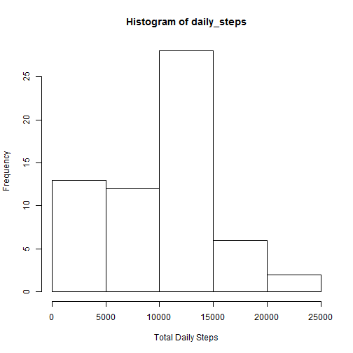
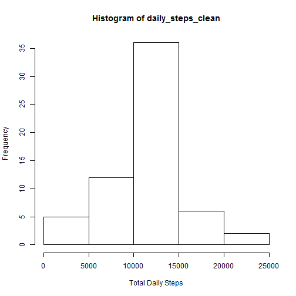
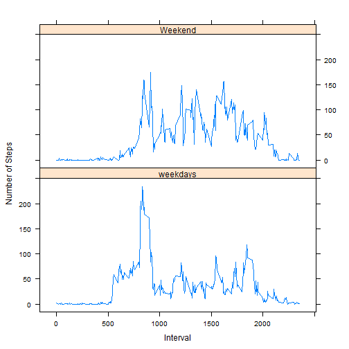

# Reproducible Research: Peer Assessment 1


## Loading and preprocessing the data
Load the data and then add a datetime field.


```r
activity <- read.csv("activity.csv")
activity$datetime <- strptime(activity$date, format = "%Y-%m-%d")
```


## What is mean total number of steps taken per day?

Calucate the daily total steps and plot a histogram and calculate  mean and median:

```r
daily_steps <- by(activity$steps, activity$date, sum, na.rm = T)
hist(daily_steps, xlab = "Total Daily Steps")
```

 

```r
m <- mean(daily_steps)
md <- median(daily_steps)
```


**Mean Steps taken per day :** *9354.2295*  
**Median Steps taken per day :** *10395*  


## What is the average daily activity pattern?
Calculate the the average number of steps taken, averaged across all days and then plot a time seriers plot.


```r
library(plyr)  # load the plyr package for ddply
mean_steps <- ddply(activity, .(interval), function(x) mean(x$steps, na.rm = T))
names(mean_steps) <- c("interval", "steps")

plot(mean_steps, type = "l")
```

 

```r

max_steps_interval <- mean_steps$interval[mean_steps$steps == max(mean_steps$steps)]
```


*5-minute interval, on average across all the days in the dataset, contains the maximum number of steps : 835*

## Imputing missing values


```r
total_missing <- sum(is.na(activity$steps))
```


Total count of missing values: 2304

**Strategy for filling the missing value :** 

Fill the NAs with the mean value calculated earlier averaged across all days for the 5-minute interval.


```r
clean_activity <- activity  # make a copy of the data

# fill the Nas with the mean
clean_activity$steps[is.na(clean_activity$steps)] <- round(join(mean_steps, 
    clean_activity[is.na(clean_activity$steps), ])[, 2])
```

```
## Joining by: interval, steps
```


Calculate the total daily steps from the clean data and construct the new Histrogram.


```r
# 
daily_steps_clean <- by(clean_activity$steps, clean_activity$date, sum)
hist(daily_steps_clean, xlab = "Total Daily Steps")
```

 


Calculate the new mean and median:

```r
options(scipen = 100, digits = 4)
m_new <- mean(daily_steps_clean)
md_new <- median(daily_steps_clean)
```


**Mean Steps taken per day :** *10765.64*  
**Median Steps taken per day :** *10762* 

After imputing the missing values the values of mean changes from 9354.2295 to 10765.6393 and median changes from 10395 to 10762. The total daily steps now becomes more symetric.

## Are there differences in activity patterns between weekdays and weekends?

Calculate and add a new factor variable "weekday" and make a panel plot

```r
library(lattice)

w = matrix()
for (i in (1:nrow(activity))) {
    # print(i)
    if ((weekdays(activity$datetime[i])) == "Sunday" | weekdays(activity$datetime[i]) == 
        "Saturday") 
        w[i] = "Weekend" else w[i] = "weekdays"
}
activity$weekday = w
activity$weekday = as.factor(activity$weekday)

mean_steps_week <- ddply(activity, .(interval, weekday), function(x) mean(x$steps, 
    na.rm = T))

xyplot(V1 ~ interval | weekday, data = mean_steps_week, horizontal = TRUE, type = "l", 
    layout = c(1, 2), xlab = "Interval", ylab = "Number of Steps")
```

 


Yes, there appears to be a difference in the activity pattern between weekend and weekdays. During weekends there is higher activity throughout the day whereas on weekdays highest activity is found in the morning which is greatly reduced in the rest of the day.


